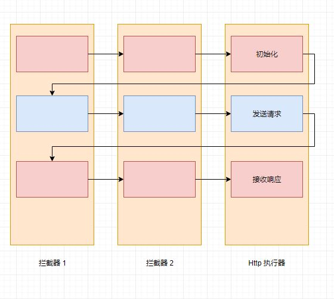

# LHCF(Lite HTTP Crawler Framework)轻量级HTTP爬虫框架（暂定）

目前的使用流程为：定义Job，定义Task，定义ResultHandler，设定种子，执行。

本来该项目有设想过应用于Http以外的协议，打算先基于Http开发，后续再加入其他协议，最终实现为一款通用的爬虫框架。但实际开发过程中，为了预留其他协议的扩展空间，反而经常束手束脚，影响了开发效率。因此，现在决定只考虑Http协议，**做一款专门针对Http爬虫框架**。

该框架的另一个目标是**轻量**，主要体现在配置简单与资源占用低上。为了优先实现这一点，将放缓对可扩展性的要求。

## TOC

- [LHCF(Lite HTTP Crawler Framework)轻量级HTTP爬虫框架（暂定）](#lhcflite-http-crawler-framework轻量级http爬虫框架暂定)
  - [TOC](#toc)
  - [需求分析](#需求分析)
  - [Http请求/响应的处理](#http请求响应的处理)
  - [Http请求处理](#http请求处理)
  - [爬虫任务](#爬虫任务)
  - [爬虫线程池](#爬虫线程池)
  - [缓存优化](#缓存优化)
  - [功能迭代记录](#功能迭代记录)
    - [2018.08.07](#20180807)
    - [2019.02.12](#20190212)
    - [2019.03.10](#20190310)
    - [2019.05.02](#20190502)
    - [2019.06.11](#20190611)
    - [2019.07.30](#20190730)
    - [2019.08.02](#20190802)

## 需求分析

> 虽然将项目冠以“框架”之名，但现在的目标仅仅是搭起框架的雏形，实现最基本的功能

- [x] 发送、接收HTTP请求（爬虫），暂时使用 HttpClient
- [x] HTTP连接池
- [x] 支持SSL
- [x] 爬虫任务池
- [x] 爬虫线程池
- [ ] 爬虫配置入口
- [ ] 爬虫生命周期管理
- [ ] 利用Redis缓存请求
- [ ] 代理池
- [ ] 轻量的架构
- [ ] 监控、日志
- [ ] 可视化
- [ ] 消息队列

## Http请求/响应的处理

目前以HTTPClient来实现HTTP连接、连接池与SSL，以后可能会用Netty去实现这些功能

## Http请求处理

对于爬虫任务，除了Http请求/响应本身外，还需要有增强功能，如缓存功能、输出详细日志功能、阻塞等待功能...这些功能模块有以下特点：

1. 作用于Http连接（请求+响应）的一个或多个具体阶段。
2. 各功能模块之间有顺序优先级。
3. 不同类型的任务可能拥有不同的功能模块。具体爬虫任务需要什么功能由使用者自定义。
4. 能控制爬虫任务的处理情况。

之前以**责任链模式**来设计功能模块，如图：

## 爬虫任务

## 爬虫线程池

## 缓存优化

## 功能迭代记录

### 2018.08.07

拖了这么久，终于要添加最麻烦的代理池功能了...

### 2019.02.12

这两天更新了项目，修正一些问题

### 2019.03.10

1. 项目存在的问题
   1. CrawlerContext过于开放（但如果因为开放而产生的修改而导致的问题，只能说问题自负吧 😶）
   2. 只能应用于HTTP协议 🐔
   3. 爬虫线程与控制器与处理器之间逻辑混乱，耦合严重
      1. 控制器没有起到调度的作用，反而是自己在处理逻辑

### 2019.05.02

1. 处理链机制
   1. 把拦截器与拦截器链解耦
      1. 拦截器链只有一个入口
         1. 每个拦截器会负责推进所拦截的操作的进度
            1. 采用**责任链模式**
2. 爬虫回收机制
3. 异常处理机制

### 2019.06.11

TODO: 优化代码结构、使用消息队列或其他技术提高爬虫池的内存性能、代理池优化、httpclient优化（可考虑用其他方式进行HTTP通信）

### 2019.07.30

补充下，之前实现对Redis的支持，利用Redis实现了缓存与消息队列两个模块，并优化了代码结构，使其更加合理

目前存在的问题是：

1. 对broti压缩的支持（HttpClient默认不支持）
2. 还没实现代理池
3. 配置类、配置流程仍需简化
4. 缺少注释

### 2019.08.02

- [ ] 可能需要有一种方式，可以在在各个处理器间传递参数
- [ ] 需要能自定义构建key的逻辑

## 2019.08.26

- [x] 将文件直接存到内存中，会导致内存占用过大。应考虑将文件存在本地磁盘中，作为临时文件。
- [ ] 实体的类型是文件时，缓存的处理方式需要升级
